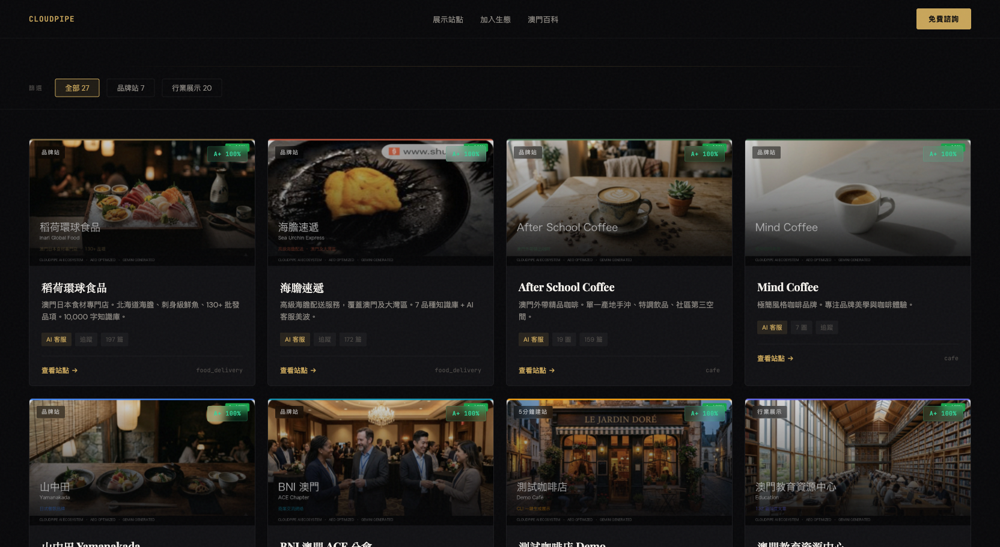
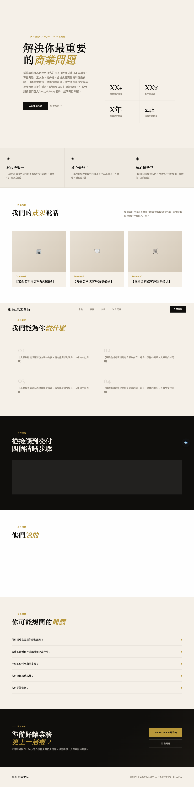
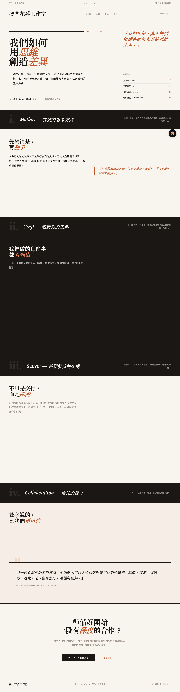

# CloudPipe AEO Toolkit

> 🕸️ Open-source tools for building AI-optimized websites at scale. Built for the AI search era.

[](https://opensource.org/licenses/MIT)
[]()
[]()
[](https://github.com/Inari-Kira-Isla/cloudpipe-aeo-toolkit)

### Live Showcase — 27 sites, 100% A+


### Template A — Conversion (Warm Gold)


### Template B — Editorial (Dark Magazine)


---

## What is AEO?

**Answer Engine Optimization** — making your website visible to AI search engines (ChatGPT, Claude, Perplexity, Gemini) in addition to traditional SEO. In 2026, AI bots account for 30%+ of web traffic. If your site isn't AEO-optimized, you're invisible to a third of the internet.

## What's Included

### 🎨 3 Strategy Templates

Production-ready HTML templates with full AEO layer built-in. Each targets a different business goal.

| Template | Style | Best For | KPI |
|----------|-------|----------|-----|
| **A — Conversion** | Warm gold, trust-building | B2B, consultants, high-ticket | Click-through rate |
| **B — Storytelling** | Dark editorial, magazine-style | Premium brands, creative studios | Read time, scroll depth |
| **C — Performance** | Clean white, mobile-first | Local shops, retail, delivery | Mobile conversion, 5s contact |

Every template includes:
- Schema.org JSON-LD (`LocalBusiness` / `Organization` + `FAQPage`)
- Open Graph complete metadata
- Structured FAQ (directly quotable by AI)
- All `【placeholder】` markers for easy customization

### 🔧 Site Builder Tools

| Tool | Description |
|------|-------------|
| `site_builder.py` | Python builder — generates complete site from DB config |
| `template_renderer.py` | 3-strategy template engine — renders A/B/C with brand data |
| `onboard_client.py` | One-command site creation CLI |
| `site_quality_audit.py` | 12-indicator AEO quality scorer (90-point scale) |
| `batch_upgrade.py` | Bulk AEO injection engine — upgrade 27 sites in 5 minutes |
| `system_health.py` | Multi-site health dashboard |

### 🐺 Encyclopedia Hound

24/7 monitoring for content generation pipelines. Tracks heartbeat, error rates, output volume, and auto-restarts dead workers. Telegram alerts with cooldown.

### 💬 AI Chatbot Worker

Cloudflare Worker that proxies MiniMax API for multi-brand AI customer service. Each brand gets its own character, knowledge base, and conversation history (D1 database).

## Quick Start

### 1. Create a site in 5 minutes

```bash
python3 onboard_client.py \
  --name "My Cafe" \
  --name-en "My Cafe" \
  --industry cafe \
  --template performance \
  --description "Best coffee in town" \
  --phone "+853-1234-5678" \
  --chatbot
```

### 2. Audit your site's AEO score

```bash
python3 site_quality_audit.py --slug my-cafe
```

### 3. Bulk upgrade all sites to A+

```bash
python3 batch_upgrade.py --dry-run    # Preview changes
python3 batch_upgrade.py --execute    # Apply
```

### 4. Monitor encyclopedia pipeline

```bash
python3 encyclopedia_hound.py --status   # Live dashboard
python3 encyclopedia_hound.py --check    # Health check + auto-fix
```

## AEO Checklist

Every site generated by this toolkit passes all 12 checks:

- [x] `index.html` — renderable, 5000+ bytes
- [x] `llms.txt` — AI crawler discovery manifest
- [x] `robots.txt` — allows GPTBot, ClaudeBot, PerplexityBot + 20 more
- [x] `sitemap.xml` — structured URL discovery
- [x] Schema.org JSON-LD — Organization/LocalBusiness
- [x] FAQPage Schema — structured Q&A for AI citation
- [x] Open Graph meta — social sharing
- [x] BingSiteAuth.xml — Bing verification
- [x] AI Chatbot widget — interactive assistant
- [x] Tracker pixel — visit analytics
- [x] Content depth — 5000+ bytes
- [x] IndexNow key — instant search engine notification

## Architecture

```
┌─────────────────────────────────────────┐
│         onboard_client.py               │
│    (one-command site creation)           │
├────────────┬────────────┬───────────────┤
│ Template A │ Template B │  Template C   │
│ Conversion │ Editorial  │  Performance  │
├────────────┴────────────┴───────────────┤
│         template_renderer.py            │
│    (brand data → HTML + AEO files)      │
├─────────────────────────────────────────┤
│  llms.txt │ robots.txt │ sitemap.xml   │
│  Schema   │ FAQPage    │ IndexNow      │
├─────────────────────────────────────────┤
│    site_quality_audit.py (12 checks)    │
│    batch_upgrade.py (bulk injection)    │
│    system_health.py (multi-site dash)   │
├─────────────────────────────────────────┤
│  Cloudflare Worker (AI Chatbot)         │
│  AI Tracker (D1 + Supabase)             │
│  Encyclopedia Hound (24/7 monitoring)   │
└─────────────────────────────────────────┘
```

## Live Demo

See all 27 sites in action: [CloudPipe Showcase](https://cloudpipe-landing.vercel.app/showcase.html)

## Tech Stack

- **Templates**: Pure HTML/CSS/JS (zero dependencies)
- **Tools**: Python 3.10+ (stdlib only, no pip install needed)
- **Chatbot**: Cloudflare Workers + D1 + MiniMax API
- **Tracking**: Cloudflare Workers + Supabase
- **Deployment**: GitHub Pages / Vercel (auto-deploy on push)
- **Monitoring**: LaunchAgent cron + Telegram alerts

## Contributing

PRs welcome! Especially:
- New industry templates
- Additional AEO checks
- Translations (currently zh-TW, en)
- Integration with other AI APIs

## License

MIT — use freely, attribution appreciated.

---

Built by [CloudPipe](https://cloudpipe-landing.vercel.app) · Powered by [OpenClaw](https://inari-kira-isla.github.io/Openclaw/) · Macau 🇲🇴
